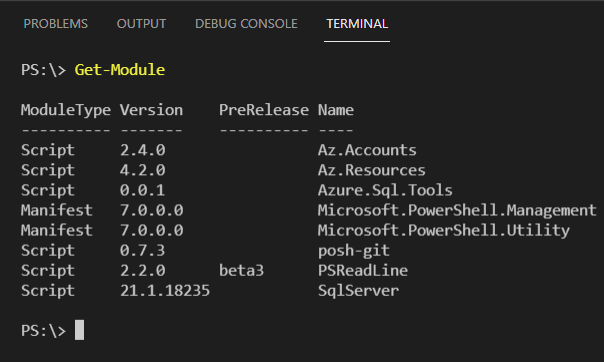
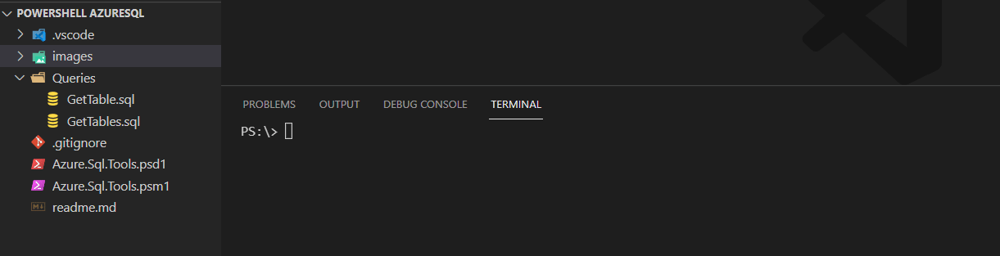
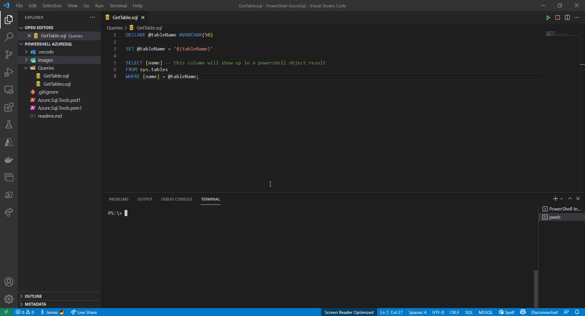
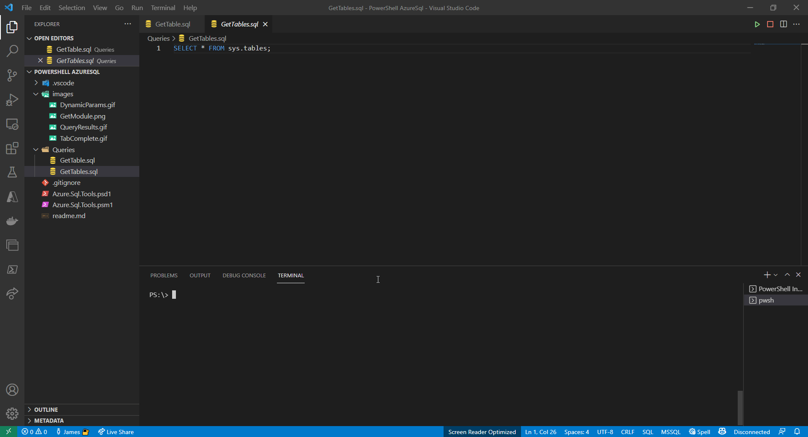

# Azure.Sql.Tools

## Description

Azure SQL Tools is just a fun experiment to get a PowerShell module to consume native SQL files and load dynamic parameters for the required values in the query.
It also has all the convenience features from Azure PowerShell, like tab completion on Azure resources. Lastly, I wanted to use single sign-on to access the data making this tool pretty nifty.

## Requirements

- Install the newest PowerShell - [Link](https://github.com/PowerShell/PowerShell#get-powershell)
- Install Azure PowerShell Module - [Link](https://docs.microsoft.com/en-us/powershell/azure/install-az-ps?view=azps-6.2.1)
- Connect Azure PowerShell - [Link](https://docs.microsoft.com/en-us/powershell/azure/get-started-azureps?view=azps-6.2.1)
- Add SqlServer Module

```powershell
# First time install
Install-Module SqlServer -Scope CurrentUser -Force

# Updating Module
Update-Module SqlServer -Scope CurrentUser -Force
```

## Getting Started with Azure.Sql.Tools

### Importing the Module

```powershell
Import-Module ".\path\to\Azure.Sql.Tools.psd1"
Get-Module
```

- Your output should have the following
  - Az.Accounts 2.4.0 or greater
  - Az.Resources 4.2.0 or greater
  - Azure.Sql.Tools 0.0.1 or greater
  - SqlServer 21.1.18235 or greater



### Using the command

- Tab Completions
  - Fill out dash parameters
  - Finish partial server names
  - Finish partial database names
  - Find required parameters in your sql files



### Creating a Sql File

- All parameters must be handled via DECLARE & SET syntax
- All parameters are dynamically generated and can be passed in as switches
- The parameter must match this naming convention '\$(thisBecomesTheSwitch)' wrapped by quotes $ and parenthesis



### Using Objects & Reporting

- Just set variables via $result or any term you want
- You can then manipulate the object as you please
  - Note that tab completion work on table column names

```powershell
$result = Invoke-AzureSqlCmd -Server jameskdemo -Database HelloPowerShell -QueryName GetTable.sql -tableName "BuildVersion"
$result.name

# if you want an output report
$result | ConvertTo-Csv | Out-File results.csv
```


